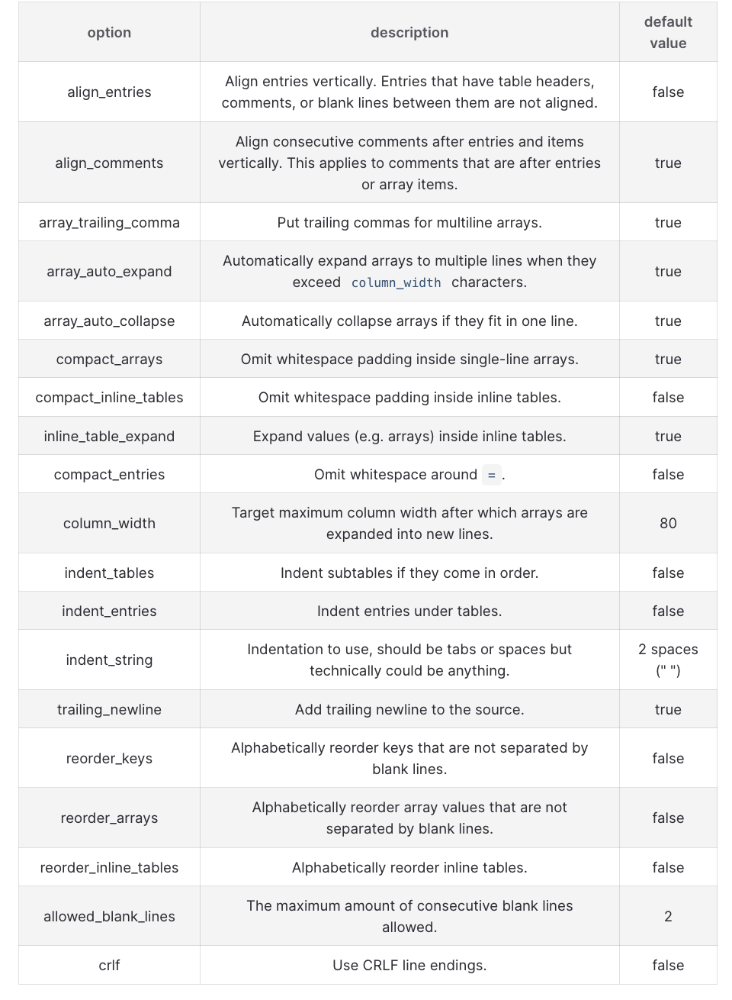

TOML stands for "Tom's Obvious Minimal Language".

From [TOML's website](https://toml.io/en/):

> TOML aims to be a minimal configuration file format that's easy to read due to obvious semantics. TOML is designed to map unambiguously to a hash table. TOML should be easy to parse into data structures in a wide variety of languages.

Many configuration files are `.toml` files (e.g. `pyproject.toml` or `air.toml`) and I have engaged with `.toml` files for several years.

Within the past month, I learned about `taplo` (<https://taplo.tamasfe.dev/>) which is a "...versatile, feature-rich TOML toolkit" written in Rust (<https://github.com/tamasfe/taplo>) that can be used for linting and formatting `.toml` files. One can add this tool as a `pre-commit` hook with a dedicated configuration file, e.g.

(in `taplo.toml`)

```toml
[formatting]
align_entries = true
column_width  = 79

# see https://taplo.tamasfe.dev/configuration/formatter-options.html
# for more formatting options
```

(in `.pre-commit-config.yaml`)

```yaml
-   repo: https://github.com/ComPWA/taplo-pre-commit
    rev: v0.9.3
    hooks:
    -   id: taplo-format
    -   id: taplo-lint
        args: ["--no-schema"]
```

The options available to format are given in the table below:



Find below an example `.toml` file (the `pyproject.toml` file for my home site) before and after linting and formatting (using the aforementioned `taplo.toml` and `.pre-commit-config.yaml` settings):

<details markdown=1>

<summary> Before Taplo </summary>

```toml
[project]
name = "o957-github-io"
version = "0.0.1"
authors = [
  {name = "O957", email = "127630341+O957@users.noreply.github.com"},
]
description = "My home page, which contains some information about my person, activities, and work."
license = "Apache-2.0"
readme = "README.md"
keywords = ["personal", "website", "data-science", "paleontology"]
requires-python = ">=3.11"
dependencies = [
    "blackjax>=1.6.2",
    "jax>=0.10.2",
    "numpyro>=0.21.0",
]

[project.urls]
Repository = "https://github.com/O957/O957.github.io"
Issues = "https://github.com/O957/O957.github.io/issues"
"Author GitHub" = "https://github.com/O957"

[tool.ruff.lint.mccabe]
max-complexity = 12

[tool.vulture]
paths = ["scripts"]
```

</details>

<details markdown=1>

<summary> After Taplo </summary>

```toml
[project]
name = "o957-github-io"
version = "0.0.1"
authors = [
  { name = "O957", email = "127630341+O957@users.noreply.github.com" },
]
description = "My home page, which contains some information about my person, activities, and work."
license = "Apache-2.0"
readme = "README.md"
keywords = ["personal", "website", "data-science", "paleontology"]
requires-python = ">=3.11"
dependencies = ["blackjax>=1.6.2", "jax>=0.10.2", "numpyro>=0.21.0"]

[project.urls]
Repository      = "https://github.com/O957/O957.github.io"
Issues          = "https://github.com/O957/O957.github.io/issues"
"Author GitHub" = "https://github.com/O957"

[tool.ruff.lint.mccabe]
max-complexity = 12

[tool.vulture]
paths = ["scripts"]

```

</details>
